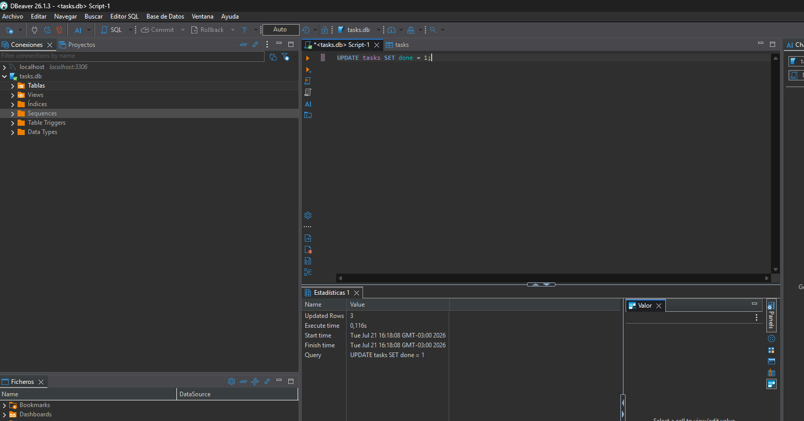

# Todo API (SQLite)

A lightweight RESTful API for managing tasks, built with Node.js, Express
and SQLite. Persistence is provided by a single `tasks.db` file that is
created and seeded automatically the first time the server boots.



## Why SQLite

- **Zero configuration.** No external server, no driver install, no
  network. The whole database is a single file on disk.
- **Built into Node.js.** This project uses the `node:sqlite` module
  shipped with Node 22.5+, so no native dependency has to be compiled.
- **Perfect for dev and small deployments.** Reads are fast, the file
  is portable, and you can inspect it with any SQLite client.
- **Same API, different storage.** When the time comes to move to
  PostgreSQL, MySQL or another engine, only the data layer changes; the
  HTTP endpoints stay identical.

## Stack

- **Runtime:** Node.js 22.5+ (uses built-in `node:sqlite`)
- **Framework:** Express 5
- **Database:** SQLite (file-based, `tasks.db`)
- **Config:** `dotenv`

## Prerequisites

- Node.js **v22.5.0 or newer** (the project relies on `node:sqlite`).
  Verify with:

  ```bash
  node -v
  ```

## Installation

```bash
git clone https://github.com/amarillaRodrigo/javascript-101.git
cd javascript-101
npm install
cp .env.example .env
```

`.env` defaults to:

```
PORT=3000
DB_PATH=tasks.db
NODE_ENV=development
```

Override `DB_PATH` if you want the database file to live somewhere else
(e.g. on a Render persistent disk: `/var/data/tasks.db`).

## Running

```bash
npm run dev      # development with --watch (auto-reload)
npm start        # plain node server.js
```

On the very first boot the app will:

1. Create `tasks.db` next to `server.js` (or at `DB_PATH` if set).
2. Create the `tasks` table if it does not exist.
3. Insert three example tasks **only if the table is empty**.

Every subsequent restart logs:

```
[db] tasks.db already has N row(s), skipping seed
```

## Database

| Property      | Value                                     |
|---------------|-------------------------------------------|
| Engine        | SQLite                                    |
| File          | `tasks.db` at the repo root (or `DB_PATH`)|
| Auto-created  | Yes, on first open                        |
| Auto-seeded   | Yes, only when the table is empty         |

### Schema

```sql
CREATE TABLE tasks (
  id    INTEGER PRIMARY KEY AUTOINCREMENT,
  title TEXT    NOT NULL,
  done  INTEGER NOT NULL DEFAULT 0
);
```

`done` is stored as `0`/`1`; the API exposes it as a real boolean.

### Seed data (first run only)

| id | title                     | done |
|----|---------------------------|------|
| 1  | Comprar leche             | 0    |
| 2  | Estudiar Express + SQLite | 0    |
| 3  | Hacer deploy en Render    | 1    |

### Example SQL query

Mark every task as completed:

```sql
UPDATE tasks SET done = 1;
```

The five queries used during the W3 · A1 exploration are preserved at
[`docs/sql-explore.sql`](docs/sql-explore.sql).

## API endpoints

Base URL: `http://localhost:3000`

| Method | Path              | Description                  |
|--------|-------------------|------------------------------|
| GET    | `/`               | Health check + DB path       |
| GET    | `/api/todos`      | List all tasks               |
| GET    | `/api/todos/:id`  | Get one task                 |
| POST   | `/api/todos`      | Create a task (201 / 400)    |
| PUT    | `/api/todos/:id`  | Update a task (200 / 404 / 400) |
| DELETE | `/api/todos/:id`  | Delete a task (200 / 404)    |

### Create

```bash
curl -X POST http://localhost:3000/api/todos \
  -H "Content-Type: application/json" \
  -d '{"title":"Sacar la basura"}'
```

`title` is required and trimmed. `done` is optional and must be a boolean
(defaults to `false`). Returns **400** when invalid, **201** on success.

### Update

```bash
curl -X PUT http://localhost:3000/api/todos/1 \
  -H "Content-Type: application/json" \
  -d '{"done":true}'
```

Partial update: send `title`, `done`, or both. Empty `title` returns
**400**. Unknown id returns **404**.

### Delete

```bash
curl -X DELETE http://localhost:3000/api/todos/1
```

Returns **200** `{ "success": true, "data": {} }` or **404** if the id
does not exist.

### Error shape

```json
{ "success": false, "error": "Task not found" }
```

```json
{ "success": false, "error": "Title is required" }
```

## Deployment to Render

SQLite is a single file, so the host needs a **persistent disk** between
deploys. Render's free Web Services do not include one; on the Standard
plan attach a disk and point `DB_PATH` to it.

1. New + → Web Service → connect this repo.
2. Build Command: `npm install`
3. Start Command: `node server.js`
4. Add a persistent disk mounted at `/var/data`.
5. Environment variables:
   - `DB_PATH=/var/data/tasks.db`
   - `NODE_ENV=production`

Without a persistent disk the database resets on every redeploy, which is
fine for demos but not for real use.

## Project structure

```
javascript-101/
├── docs/
│   ├── screenshots/
│   │   └── sqlite-viewer.png
│   └── sql-explore.sql
├── src/
│   └── db.js                # opens tasks.db, creates schema, seeds
├── server.js                # Express app + CRUD endpoints
├── tasks.db                 # auto-generated, ignored by git
├── .env.example
├── .gitignore
├── package.json
└── README.md
```

## License

ISC